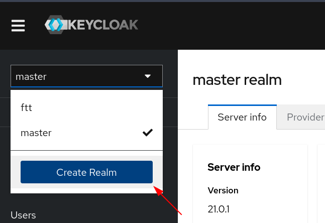
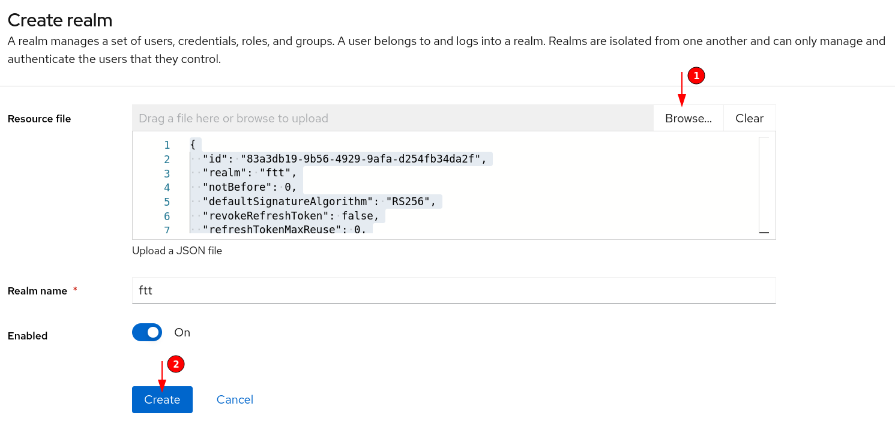
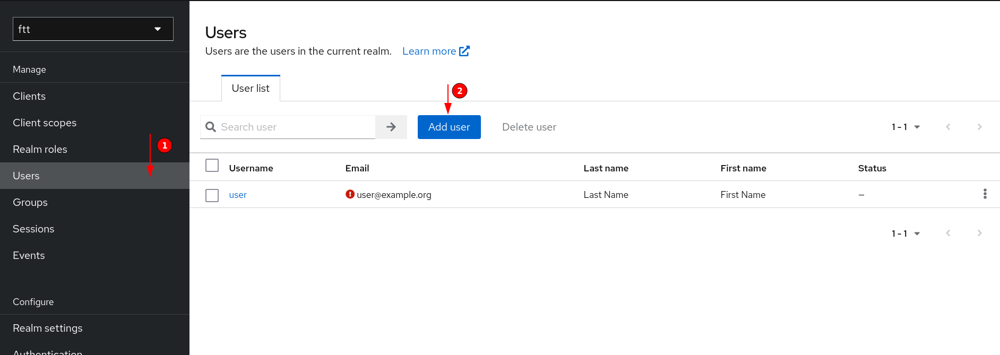
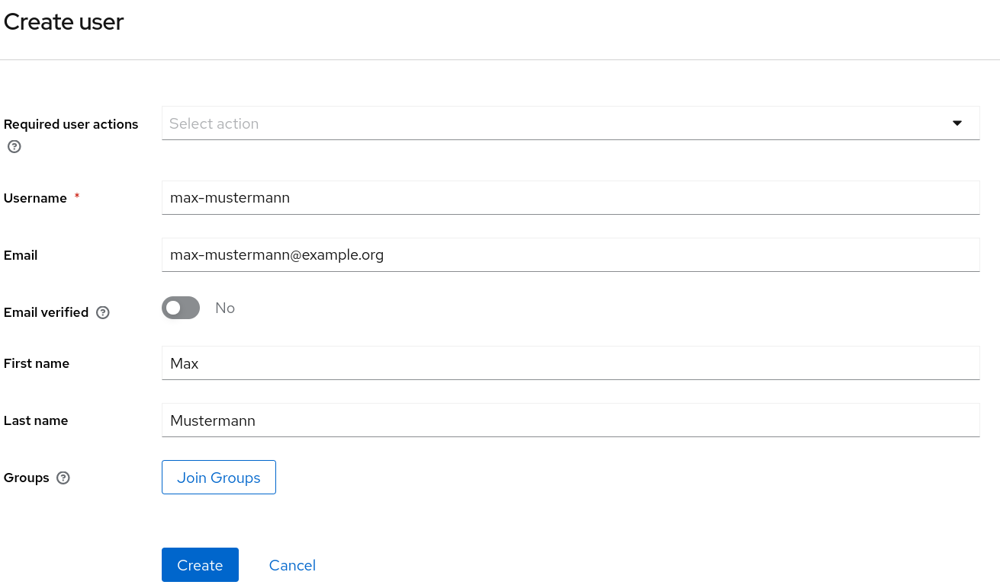
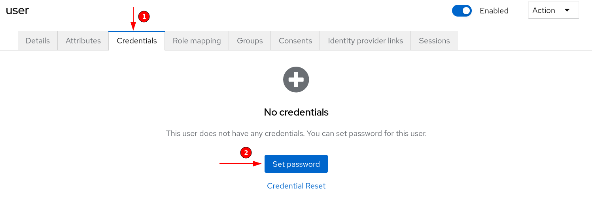
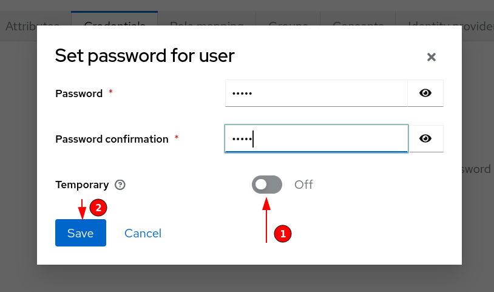

# Installation Guide

## Links

* [Keycloak Installation](#keycloak-installation)
    * [Import Realm](#import-realm)
    * [Add User](#add-user)
* [Insomnia Setup](#insomnia-setup)

## Keycloak Installation

### Import Realm

Next navigate to `Create Realm` on the Keycloak Admin GUI



Now, that you're in the `Create Realm` dialog, Click on the `Browse`-Button in the Resource File Text Box.



When you've selected your `ftt-realm.json`, which is located in the Projects Root Directory, the fields will be filled,
and you can finally click on `Create`.

After these steps your realm is created!

### Add user

⚠️ **Important**: For the best compatibility with the Insomnia Workspace create a user with the following Credentials;

```
Username - user
Password - .user
```

Unfortunately we found no way yet to export credentials for testing

You still need a user in order to access the api and use the client.  
This time you have to navigate to the `Users`-Tab and Click on `Add user`.



There you can define example user data



After you've created a user, you need credentials (a password).  
For that, click on the user in the user list, click on the `Credentials`-Tab and click on `Set password`



Set a password that you like, disable the `Temporary`-Checkbox (Important! Otherwise, the user won't be activated)
and click on set Password.



And now, you successfully set up Keycloak! 🎉

## Insomnia Setup

In order to use the Insomnia Environment, following steps are required

1. Set up a private Environment with the following Envs
    ```json
    {
        "profile_uuid": "<ADMIN-PROFILE-UUID>",
        "session_id": "<ADMIN-PROFILE-SESSION-ID>"
    }
    ```
2. Set up the Application, create a Household and an Admin Profile
3. Get the UUID of the Admin Profile (e.g. by `Get All Profiles`)
4. Paste the UUID into the `profile_uuid` of the private Environment
5. Run the `Authenticate`-Request and paste the Session ID into the `session_id` of the private Environment
6. You're good to go to execute Admin Requests and Routes that require a Session ID 🎉
